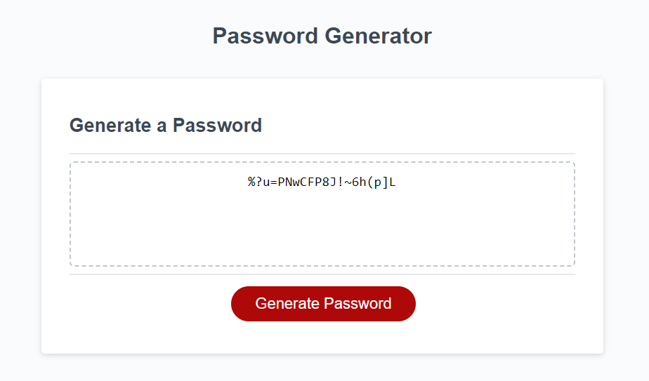

# Password Generator 
This is a pretty basic password generator. It includes:
- Character limits from 8 through 125
- Choice to include lowercase and uppercase letters
- Choice to have numbers
- Choice to have any special characters

After selecting all your options, your password is generated and is ready for use.
Here's an example of how it looks:

And here's a link to the deployed website: [Password Generator](https://supersteve729.github.io/Password-Generator/)
